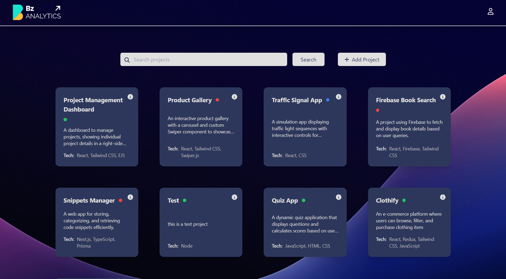

# ENV - Manager

## Description
This project is built using **Node.js** and **EJS** for the frontend. It follows the **MVC architecture** and uses **MySQL** as the database. The project allows users to perform CRUD operations and manage data efficiently.

The project is designed for **environment management for developers**, allowing users to create new accounts using email and password, using there account manage environment efficiently. It includes a **Super Admin** role with additional controls over the entire project.

## Features
- Node.js with Express.js
- EJS templating engine
- MySQL database (included as a file - msqlDB.sql)
- MVC architecture
- CRUD operations
- Environment variables for configuration (file - example_env.txt)
- User authentication (Email & Password)
- **Super Admin** with full control

## Installation

### Prerequisites
Ensure you have the following installed:
- **Node.js** (v14+ recommended)
- **XAMPP** (to run MySQL locally)

### Getting Started

1. **Install dependencies:**

   ```bash
   npm install

2. **Start server:**

   ```bash
   node index.js  


### 🖼️ Screenshot


### 🚀 Live Demo
[Click here to try the live app](https://env-management-bz.onrender.com/)